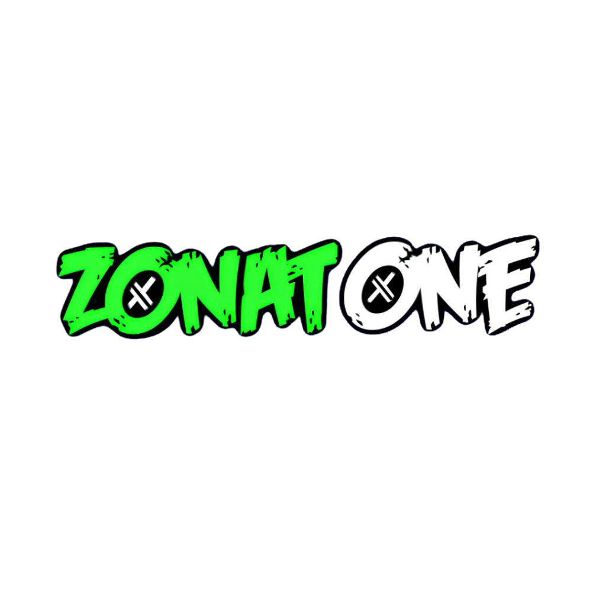

# ZonatOne - Web3 Social Media Platform



## 🌐 Overview

**ZonatOne** adalah platform media sosial Web3 yang menggunakan **Phantom Wallet** untuk autentikasi. Mirip dengan Facebook, namun terdesentralisasi dan dibangun dengan teknologi Web3.

## ✨ Features

### 🔐 Web3 Authentication
- Login menggunakan Phantom Wallet
- **Tidak perlu SOL balance** untuk mendaftar dan login
- Wallet address sebagai unique identifier
- Persistent sessions dengan localStorage

### 👤 User Profiles
- Username customizable
- Avatar support (URL-based)
- Wallet address display (shortened format)
- Profile stats (posts, friends, likes)

### 📱 Social Features
- **News Feed** - Stream of posts dari users
- **Create Posts** - Text + optional images
- **Likes** - Like/unlike posts
- **Comments** - Comment system
- **Stories** - Horizontal scrolling story carousel
- **Friend Suggestions** - Discover new users

### 🎨 Premium Design
- **ZonatOne Branding** - Green accent color (#00ff41)
- **Glassmorphism** - Modern semi-transparent cards
- **Dark Mode** - Eye-friendly dark theme
- **Smooth Animations** - Fade-in, hover effects
- **Responsive** - Mobile & desktop support

## 🚀 Quick Start

### Prerequisites

1. **Install Phantom Wallet**
   - Visit [phantom.app](https://phantom.app/)
   - Install browser extension
   - Create or import a wallet

### Running Locally

1. Clone repository:
```bash
git clone https://github.com/ZonatOne/ZonatOnemedsos.git
cd ZonatOnemedsos
```

2. Open `index.html` in your browser:
```bash
# On Linux/Mac
open index.html

# Or just double-click the file
```

3. Connect your Phantom Wallet and start using ZonatOne!

## 📂 Project Structure

```
ZonatOnemedsos/
├── index.html          # Main HTML structure
├── styles.css          # Complete design system
├── app.js              # Web3 logic & social features
├── assets/
│   └── logo.png        # ZonatOne logo
└── README.md           # This file
```

## 🔧 Tech Stack

- **HTML5** - Semantic markup
- **CSS3** - Custom properties, grid, flexbox, animations
- **Vanilla JavaScript** - No frameworks
- **Phantom Wallet SDK** - Solana wallet integration
- **localStorage** - Client-side data persistence

## 💡 How It Works

### Authentication Flow

1. User opens app → Login page appears
2. Click "Connect Phantom Wallet"
3. Phantom extension prompts for approval
4. If new user → Profile setup page
5. If existing user → Main feed
6. User can create posts, like, comment
7. Logout disconnects wallet

### Data Storage

All data is stored in browser's localStorage:
- `currentUser` - Currently logged in user
- `zonatone_users` - All registered users
- `zonatone_posts` - All posts with likes & comments

**Note:** This is a demo/prototype. For production, you'd need a proper backend or Solana program for persistent storage.

## 🎨 Design System

### Colors
- **Primary Green:** `#00ff41` - Brand color
- **Accent Blue:** `#00d4ff`
- **Accent Purple:** `#b400ff`
- **Background:** `#0a0a0a`

### Typography
- **Font:** Inter (Google Fonts)
- **Weights:** 300-800

### Effects
- Glassmorphism cards
- Gradient buttons
- Glow effects on interactive elements
- Smooth transitions (0.2s-0.5s)

## 📱 Screenshots

### Login Page


### Main Feed


## 🔮 Future Enhancements

- [ ] Solana Program integration for on-chain data
- [ ] IPFS storage for images
- [ ] Token-gated posts
- [ ] NFT profile pictures
- [ ] Wallet-to-wallet messaging
- [ ] On-chain likes/reactions
- [ ] Smart contracts for post ownership
- [ ] Real-time updates with WebSockets

## 🤝 Contributing

Contributions are welcome! Feel free to:
1. Fork the repository
2. Create a feature branch
3. Make your changes
4. Submit a pull request

## 📄 License

MIT License - feel free to use this project for learning and development!

## 👨‍💻 Developer

Built with 💚 by the ZonatOne team

## 🔗 Links

- **GitHub:** [ZonatOne/ZonatOnemedsos](https://github.com/ZonatOne/ZonatOnemedsos)
- **Phantom Wallet:** [phantom.app](https://phantom.app/)
- **Solana:** [solana.com](https://solana.com/)

---

**Note:** This is a demonstration project showcasing Web3 social media concepts. User data is stored locally and will be lost if browser data is cleared.
